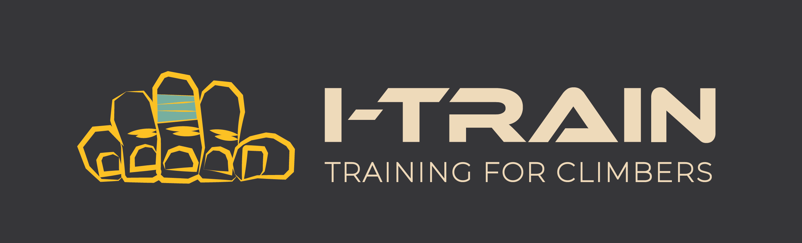

# Contenido

-   [Anteproyecto](Anteproyecto/README.md)
-   [App](App/README.md)
-   [Diario de trabajo](Advances/README.md)
-   [Landing page](Landing-page/README.md)
-   [Mockup](Mockup/README.md)

## I-Train Server

-   [Enlace al repositorio de la API](https://github.com/VictorGallardo/I-Train-server)

## I-Train Admin

-   [Enlace al repositorio de la Web de administración](https://github.com/VictorGallardo/I-Train-admin)

### :movie_camera:  Video 

 [Primera version I-Train 1.1.0 ](https://drive.google.com/file/d/1rrB4uA3F1u-7I0r0mJRuVqMvU_hUDgvz/view?usp=sharing)

